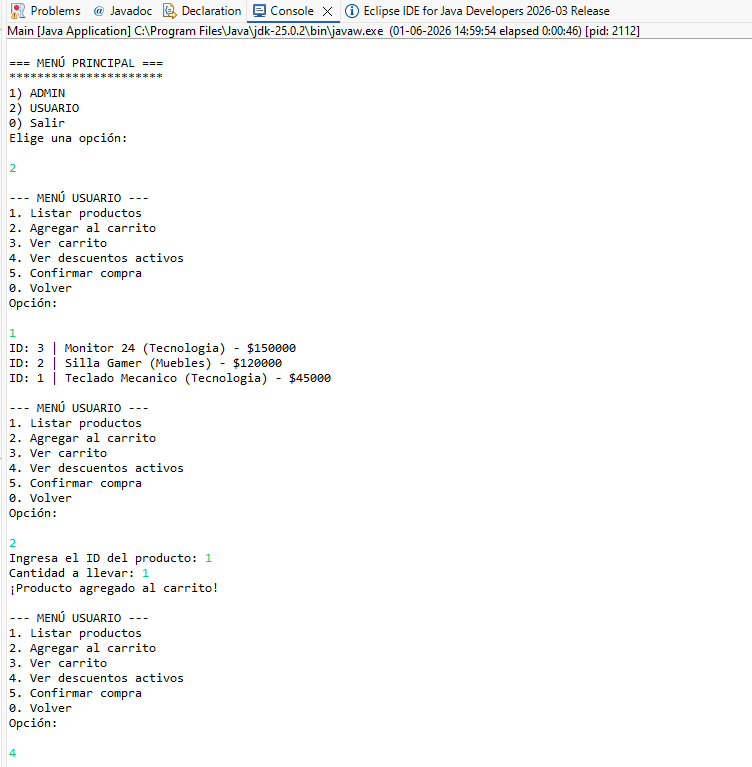
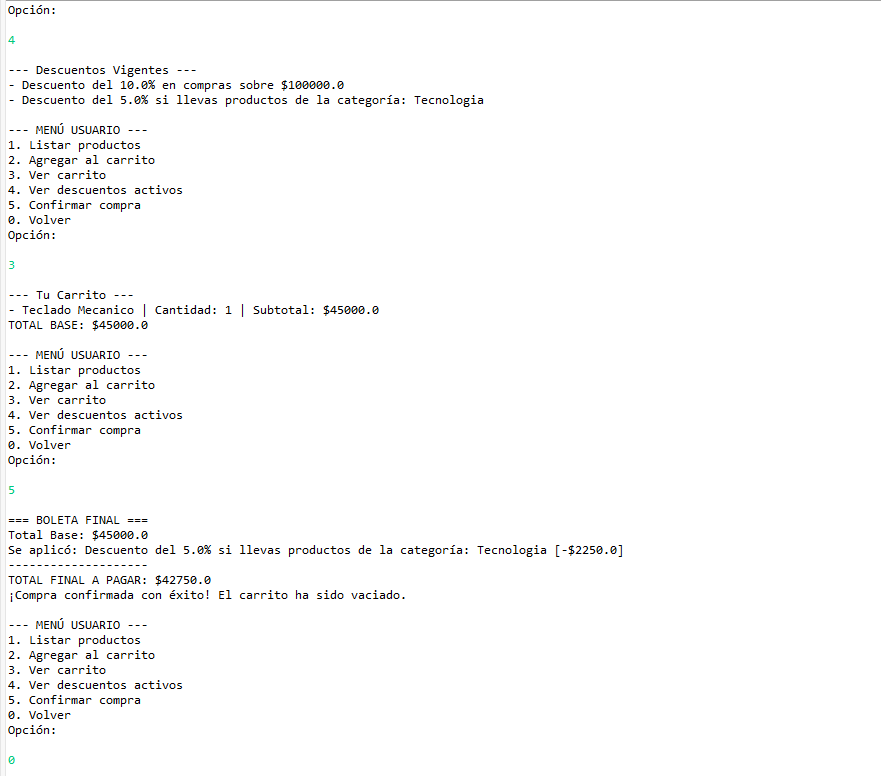
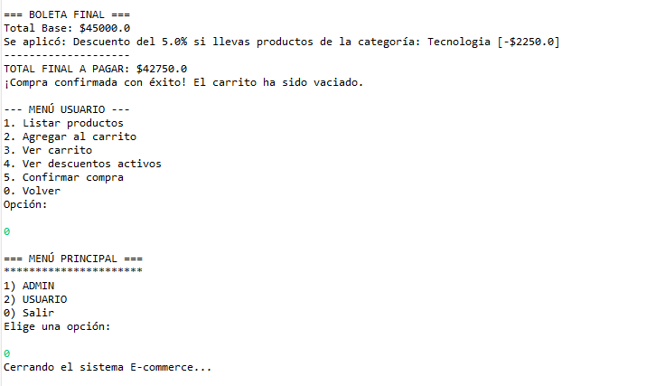
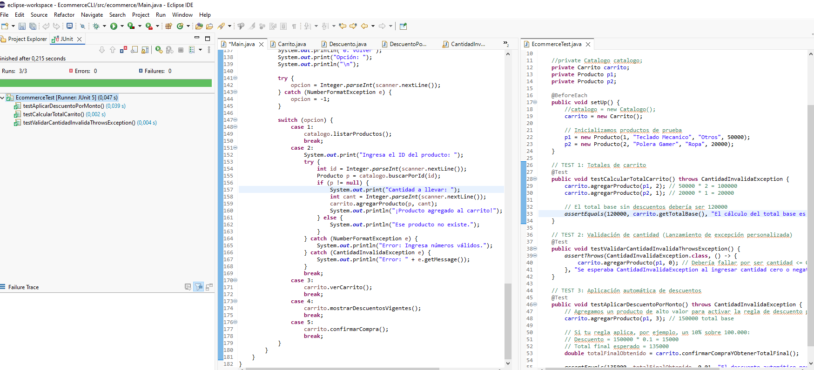

# E-commerce CLI - Módulo 4

¡Bienvenido al proyecto **Ecommerce-CLI**! Esta es una aplicación de consola desarrollada en Java que simula el funcionamiento de una tienda en línea, dividida en dos flujos principales de operación:
**Administrador** y **Usuario**. El sistema aplica principios de Programación Orientada a Objetos (POO), colecciones en memoria, manejo estricto de excepciones personalizadas y pruebas unitarias automáticas con JUnit 5.

## 🔗 Enlace al Repositorio
* **GitHub:** [https://github.com/Alefuentes982/ecommerce-cli-m2](https://github.com/Alefuentes982/ecommerce-cli-m2) 

---

## 📋 Estructura de Menús Disponibles 
**El sistema cuenta con validaciones integradas para asegurar el control de flujo por rol:** \
**Menú Principal** \
**1)ADMIN:** Gestión completa del catálogo de productos. \
**2) USUARIO:** Gestión de carrito de compras, visualización de descuentos y confirmación. \
**0) Salir:** Cierre seguro de la aplicación. 

**Flujo Administrador (ADMIN)** 

**Listar productos:** Muestra todos los artículos ordenados alfabéticamente por nombre. \
**Buscar producto:** Permite filtrar productos escribiendo parte de su nombre o categoría. \
**Crear producto:** Registra un nuevo ítem con ID único, nombre, categoría y precio obligatorio $> 0$. \
**Editar producto:** Modifica los campos de nombre, categoría o precio de un producto existente por su ID. \
**Eliminar producto:** Quita un producto del catálogo solicitando una confirmación explícita (s/n). 

**Flujo Usuario (USUARIO)** 

**Listar productos:** Visualización del catálogo vigente. \
**Agregar al carrito:** Añade un producto indicando su ID y una cantidad entera $> 0$ (valida existencias de ID y lanza CantidadInvalidaException si la cantidad es incorrecta). \
**Quitar del carrito:** Elimina un artículo del carrito de compras mediante su ID. \
**Ver carrito:** Muestra el desglose de los ítems agregados, subtotales por artículo y el TOTAL base de la compra. \
**Ver descuentos activos:** Lista de manera explícita las reglas automáticas de descuento vigentes en el sistema. \
**Confirmar compra:** Evalúa y aplica automáticamente los descuentos que correspondan, muestra la boleta final con el TOTAL neto, genera la orden en memoria y vacía el carrito. 

